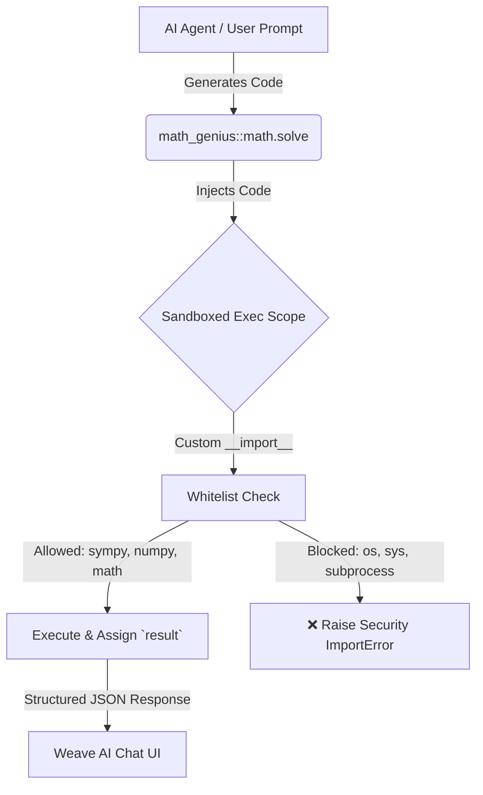

# 🧩 Math Genius (Python Plugin for Weave AI)

[](https://github.com/weave-ai/weave)
[](https://www.python.org/)
[](https://www.sympy.org/)
[](https://opensource.org/licenses/MIT)

**Math Genius** is an advanced mathematical solver plugin designed specifically for the [Weave AI](https://github.com/weave-ai/weave) workspace. It empowers AI agents to write and execute Python code in a secure, sandboxed runtime—leveraging industry-standard scientific libraries like **SymPy** and **NumPy** to solve symbolic calculus, differential equations, linear algebra, and complex algebraic problems effortlessly.

---

## ✨ Key Features

- **🧠 Symbolic Calculus & Analysis:** Compute analytical derivatives, definite/indefinite integrals, limits, series expansions, and differential equations with exact mathematical precision using SymPy.
- **🔢 Linear Algebra & Matrix Operations:** Solve systems of linear equations, eigenvalues/eigenvectors, determinants, and tensor transformations using NumPy and SymPy matrices.
- **🛡️ Sandboxed Security Architecture:** User and AI-generated scripts run inside a highly restricted Python namespace. Dangerous system modules and primitives (`os`, `sys`, `subprocess`, `socket`, `open`, `eval`, `exec`) are explicitly stripped from `__builtins__`.
- **🔐 Whitelisted Safe Imports:** Intercepts import statements via a custom `safe_import` wrapper. Only approved mathematical and scientific libraries (`sympy`, `numpy`, `scipy`, `math`, `cmath`, `decimal`, `fractions`, `statistics`, `collections`, `itertools`, `functools`, `operator`) are permitted.
- **⚡ Pre-populated Global Aliases:** For maximum speed and convenience, standard aliases (`sp` for `sympy`, `np` for `numpy`, and `math`) are automatically injected into the global execution scope.
- **💬 Seamless Slash Command Integration:** Fully integrated with Weave AI's slash-command autocomplete system. Just type `/math_genius` or `/math` in your chat box to trigger instant mathematical reasoning.

---

## 🔒 Security & Sandbox Model

To ensure zero-risk execution of arbitrary code generated by AI models, Math Genius implements a defense-in-depth sandbox in `main.py`:



1. **No System Access:** Functions capable of file I/O, process spawning, or memory manipulation are completely absent from `SAFE_BUILTINS`.
2. **Deterministic Output:** Scripts must assign their final computation to a global variable named `result`. The runtime formats the output with its exact string representation and type (`Integer`, `Add`, `Mul`, `Matrix`, etc.).

---

## 🚀 Installation & Setup

Weave AI automatically manages Python virtual environments (`.venv`) for external plugins. To install Math Genius:

### 1. Clone or Copy to Weave Plugins Directory
Weave AI discovers plugins in `~/.weave/plugins`. You can symlink or copy this repository directly:

```bash
# Ensure the Weave plugins directory exists
mkdir -p ~/.weave/plugins

# Create a symbolic link from your local clone to ~/.weave/plugins
ln -s /path/to/math-genius ~/.weave/plugins/math_genius
```

### 2. Automatic Dependency Management
When Weave AI boots or discovers the plugin, the `PluginManager` will automatically:
1. Create an isolated Python virtual environment at `~/.weave/plugins/math_genius/.venv`.
2. Execute `pip install -r requirements.txt` to install `sympy` and `numpy`.

---

## 💡 Usage & Examples

Once loaded, you can call Math Genius directly from the Weave AI chat interface using the `/math_genius` slash command or by asking natural language math questions.

### Example 1: Symbolic Differentiation
**User Prompt:**
> `/math_genius sin(x) + cos(x) fonksiyonunun x'e göre türevini al`

**AI Execution (`math.solve`):**
```python
import sympy as sp
x = sp.symbols('x')
result = sp.diff(sp.sin(x) + sp.cos(x), x)
```
**Output:**
```json
{
  "task": "Derivative of sin(x) + cos(x)",
  "success": true,
  "result_str": "-sin(x) + cos(x)",
  "result_type": "Add"
}
```

### Example 2: Definite Integration
**User Prompt:**
> `/math_genius integrate 2*x from 0 to 3`

**AI Execution (`math.solve`):**
```python
import sympy as sp
x = sp.symbols('x')
result = sp.integrate(2*x, (x, 0, 3))
```
**Output:**
```json
{
  "task": "integrate 2*x from 0 to 3",
  "success": true,
  "result_str": "9",
  "result_type": "Integer"
}
```

### Example 3: Matrix Eigenvalues
**User Prompt:**
> `/math_genius [[1, 2], [2, 1]] matrisinin özdeğerlerini bul`

**AI Execution (`math.solve`):**
```python
import sympy as sp
M = sp.Matrix([[1, 2], [2, 1]])
result = M.eigenvals()
```
**Output:**
```json
{
  "task": "Find eigenvalues of matrix [[1, 2], [2, 1]]",
  "success": true,
  "result_str": "{-1: 1, 3: 1}",
  "result_type": "dict"
}
```

---

## 📋 Capability Specification (`manifest.toml`)

| Capability | Parameters Schema | Description |
| :--- | :--- | :--- |
| `math.solve` | `{"task": "string", "code": "string"}` | Executes sandboxed Python code to solve advanced mathematical equations. The provided script must store the final answer in a `result` variable. |

---

## 🛠️ Folder Structure

```text
math-genius/
├── manifest.toml        # Weave AI plugin configuration & schema definitions
├── main.py              # Sandboxed execution engine & safe_import handler
├── requirements.txt     # Runtime dependencies (sympy, numpy)
└── README.md            # Plugin documentation
```

---

## 📄 License

This project is licensed under the **MIT License**. See the [LICENSE](LICENSE) file for details.

---

*Built with ❤️ by [Kael Valen](https://github.com/weave-ai) for the Weave AI Ecosystem.*
